# MORPH-DA Codebase Deep-Dive Review

> **Purpose of this document**: A detailed technical walkthrough of every module in the MORPH-DA research codebase, written for a human code reviewer who needs to understand *what* each piece does, *why* it exists, *how* it is connected to other pieces, and *what* could go wrong. This document is not a README — it assumes the reader will also inspect the source files alongside it.

---

## Table of Contents

1. [Project Purpose in Plain Language](#1-project-purpose-in-plain-language)
2. [Repository Layout](#2-repository-layout)
3. [End-to-End System Flow](#3-end-to-end-system-flow)
4. [Layer 1 — Data Generation (`morphda/data/`)](#4-layer-1--data-generation)
5. [Layer 2 — Task Specification (`morphda/tasks/`)](#5-layer-2--task-specification)
6. [Layer 3 — Reference Compiler (`morphda/reference/`)](#6-layer-3--reference-compiler)
7. [Layer 4 — Sandbox Execution (`morphda/execution/`)](#7-layer-4--sandbox-execution)
8. [Layer 5 — Metamorphic Relations (`morphda/relations/`)](#8-layer-5--metamorphic-relations)
9. [Layer 6 — Verification Engine (`morphda/verification/`)](#9-layer-6--verification-engine)
10. [Layer 7 — Mutation Operators (`morphda/mutations/`)](#10-layer-7--mutation-operators)
11. [Layer 8 — LLM Agent (`morphda/agents/`)](#11-layer-8--llm-agent)
12. [Layer 9 — Evaluation (`morphda/evaluation/`)](#12-layer-9--evaluation)
13. [Layer 10 — Baselines (`morphda/baselines/`)](#13-layer-10--baselines)
14. [Layer 11 — Repair (`morphda/repair/`)](#14-layer-11--repair)
15. [Layer 12 — Logging (`morphda/logging/`)](#15-layer-12--logging)
16. [Experiment Scripts (`scripts/`)](#16-experiment-scripts)
17. [Test Suite (`tests/`)](#17-test-suite)
18. [Key Design Invariants and Safety Boundaries](#18-key-design-invariants-and-safety-boundaries)
19. [Known Edge Cases and Fixes Applied](#19-known-edge-cases-and-fixes-applied)
20. [Cross-Module Dependency Map](#20-cross-module-dependency-map)

---

## 1. Project Purpose in Plain Language

MORPH-DA is a research benchmark that tests whether an AI agent can write **correct data-analysis programs** — not just programs that *run*, but programs that *compute the right answer*.

### The Core Problem It Solves

Traditional evaluation of AI-generated code asks: "Does the program produce the same output as a reference answer on the original data?" This is insufficient because:

- **Wrong-but-Executable Programs (WEPs)**: A program can run without error and produce a plausible-looking number that is *still wrong*. For example, it might compute the mean when the question asked for the sum, or apply a filter to the wrong date boundary.
- **Lucky-Correct Programs**: A program can accidentally produce the right answer on one dataset but produce the wrong answer on a different random seed. Cross-seed testing reveals these.

### What MORPH-DA Does Instead

MORPH-DA uses **Metamorphic Testing** — a technique that does not require a gold answer. Instead, it asks: *"If we transform the input data in a predictable way, does the output change in the predictable way?"*

**Example**: If a program computes a mean (average), and we double every row in the table, the mean must stay the same. If it doesn't — the program is computing a sum, not a mean.

**Example**: If a program filters orders to those in Q2 2025, and we add 50 rows dated in 2020 with enormous revenue values, the output must not change. If it does — the date filter is missing or wrong.

MORPH-DA also uses **Mutation Testing** — injecting known bugs into correct programs to verify that the metamorphic relations can detect them. The **mutation score** (fraction of injected bugs caught) measures how effective the test suite is.

---

## 2. Repository Layout

```
morph-da/
├── morphda/                    # Main Python package
│   ├── agents/                 # LLM agent harness and gateway client
│   ├── baselines/              # Competing verification methods (for comparison)
│   ├── data/                   # Synthetic dataset generators (8 business scenarios)
│   ├── evaluation/             # Metrics, bootstrap CIs, McNemar tests
│   ├── execution/              # Sandboxed Python runner + output normalizer
│   ├── logging/                # JSONL record schemas and writers
│   ├── mutations/              # Semantic fault injectors (rule-based + LLM-based)
│   ├── reference/              # Gold-answer compiler (TaskSpec → analyze() function)
│   ├── relations/              # All metamorphic relations (MR-U*, MR-F*, MR-A*, etc.)
│   ├── repair/                 # Prompt builders for feedback-guided repair
│   ├── tasks/                  # Task schema (Pydantic) + factory (101 tasks)
│   └── verification/           # Engine orchestrating relations → decision + witnesses
├── scripts/                    # Experiment runner scripts
├── tests/                      # pytest test suite
├── benchmark/                  # Frozen artifacts: task specs, mutant corpus
├── configs/                    # YAML configuration files
├── paper/                      # Paper draft (markdown)
└── runs/                       # Experiment outputs (gitignored for large files)
```

---

## 3. End-to-End System Flow

There are three main experimental pipelines. Each is shown below.

### Pipeline A — Natural Agent Experiment (Main Result)

This answers: "Does MORPH-DA correctly flag wrong programs written by LLMs?"

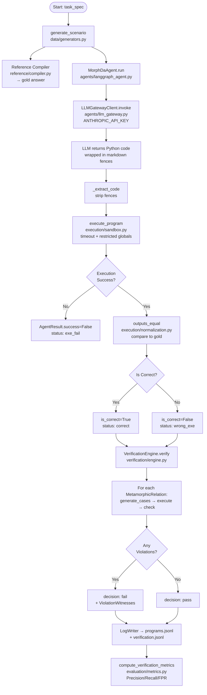

### Pipeline B — Mutation Score Experiment

This answers: "What fraction of injected semantic bugs does MORPH-DA detect?"

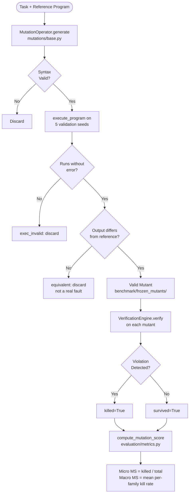

### Pipeline C — Repair Experiment

This answers: "If MORPH-DA flags a wrong program and provides a witness, can the LLM fix it?"

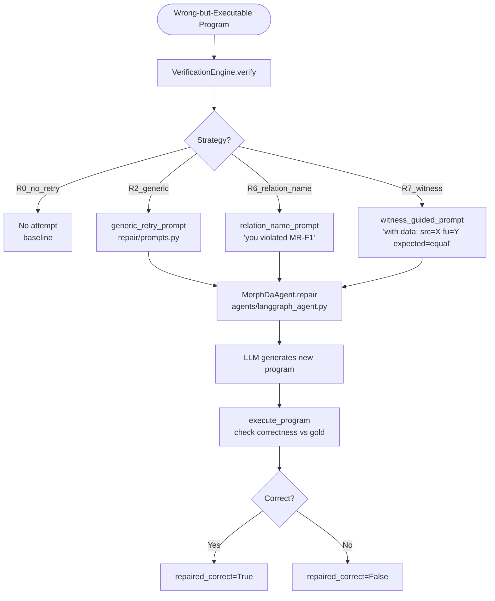

---

## 4. Layer 1 — Data Generation

**Files**: `morphda/data/generators.py`

### What It Does

Generates realistic but synthetic tabular data for 8 business scenarios. Each call to `generate_scenario(scenario_id, seed=N)` returns a dictionary of pandas DataFrames. Changing the seed changes all the values while preserving the schema.

### The 8 Scenarios

| Scenario ID | Table | Measure | Entity | Domain |
|---|---|---|---|---|
| `retail01` | `orders` | `revenue` | `customer_id` | Retail orders |
| `web01` | `sessions` + `conversions` | `page_views` | `customer_id` | Website sessions |
| `market01` | `seller_orders` | `gmv` | `seller_id` | Seller marketplace |
| `saas01` | `subscriptions` | `mrr` | `customer_id` | SaaS subscriptions |
| `mktg01` | `campaigns` | `spend` | `campaign_id` | Marketing |
| `payments01` | `transactions` | `amount` | `customer_id` | Payments |
| `ops01` | `shipments` | `cost` | `order_id` | Fulfillment |
| `support01` | `tickets` | `resolution_hours` | `customer_id` | Support |

### Key Design Choices

**Date generation**: Every generated table spans *both* the current year (2025) and prior year (2024). This ensures period-comparison tasks (Level 4/5) always have data in both windows. Dates are split 50/50 between prior and current ranges.

**Skewed distributions**: Revenue columns use `heavy_tail` (Pareto distribution) and `right` (lognormal) to simulate real business data — most orders are small, occasional orders are huge.

**Injected adversities**: The generators intentionally create:
- Null values in some columns (realistic missing data)
- Duplicate IDs (realistic data quality issues)
- Rare category groups (1-2% of rows) — these can win rankings, testing group-handling correctness
- Out-of-scope dates — rows that fall outside the analysis window

### Data Flow

```mermaid
flowchart LR
    A[ScenarioConfig\n+ TableConfig\n+ ColumnConfig] --> B[generate_tables\nseed: int]
    B --> C[_generate_table\nfor each TableConfig]
    C --> D[_generate_column\ndtype dispatch:\nint / float / category\ndate / string]
    D --> E[null_fraction injection]
    E --> F[duplicate PK injection\nif include_duplicates=True]
    F --> G[dict of DataFrames\n{'orders': pd.DataFrame ...}]
```

### Data Structures

```python
ScenarioConfig          # top-level: scenario_id, list[TableConfig], date_ranges
  └── TableConfig       # table name, n_rows, pk_column, fk_column
        └── ColumnConfig  # name, dtype, values, min/max, null_fraction, skew
```

---

## 5. Layer 2 — Task Specification

**Files**: `morphda/tasks/schema.py`, `morphda/tasks/factory.py`, `morphda/tasks/validators.py`

### schema.py — The Contract

`TaskSpec` is the central data contract of the entire system. It is a Pydantic model that fully describes *what* analysis the LLM agent must perform. Every other component reads from `TaskSpec`:
- The reference compiler reads it to generate gold-answer code
- The mutation operators read it to choose applicable mutations
- The metamorphic relations read it to choose applicable tests
- The data generator reads it (indirectly, via scenario_id) to generate appropriate data

**Key Pydantic models in `schema.py`**:

```
TaskSpec                    # Root: complete task description
├── FilterSpec              # A single WHERE clause: column, operator, value
├── DateScope               # Date window: current + optional prior period
├── JoinSpec                # Table join: left/right/keys/type
├── MetricSpec              # The thing being computed: operation + column
│   └── AggregationSpec     # Sub-aggregation for ratio numerator/denominator
├── PostFilterSpec          # HAVING clause: minimum_denominator threshold
├── ComparisonSpec          # Period-to-period operation (percentage_change)
└── RankingSpec             # Sort direction + top-k + tie_break columns
```

**`output_type` controls how answers are compared**:
- `scalar` → a single number (e.g., total revenue = $4.2M)
- `label` → a category name (e.g., "Electronics")
- `ranked_list` → ordered list of names (e.g., ["Electronics", "Clothing", "Home"])
- `label_value_pairs` → dict of name → value

**`difficulty_level`** (1–5) roughly maps to:

| Level | What It Tests | Example |
|---|---|---|
| 1 | Simple scalar aggregation | "What is total revenue?" |
| 2 | Grouped aggregation + ranking | "Which category had highest revenue in 2025?" |
| 3 | Grouped ratio + threshold | "Which category had highest conversion rate with ≥100 sessions?" |
| 4 | Year-over-year period comparison | "Which category grew most in Q2 2025 vs Q2 2024?" |
| 5 | Multi-filter + ratio + YoY comparison + threshold | Full cohort analysis |

### factory.py — The 101-Task Generator

`generate_task_set()` builds 101 `TaskSpec` objects. It calls specialized generators per scenario:

- **Original 3 scenarios** (`retail01`, `web01`, `market01`): Use handcrafted generators `_level1_tasks()` through `_level5_tasks()` with precise column names and question phrasing.
- **New 5 scenarios** (`saas01`, `mktg01`, `payments01`, `ops01`, `support01`): Use `_generic_tasks()` which reads from `_scenario_vocab()` — a dictionary mapping scenario ID → column name vocabulary.

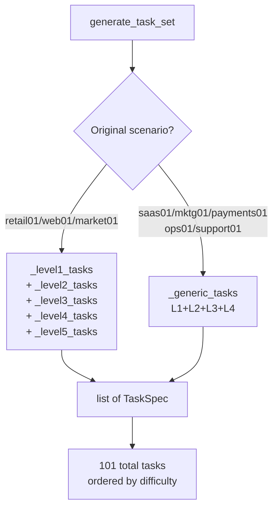

**Task ID format**: `{scenario_id}_l{level}_{idx:03d}`
Example: `retail01_l2_006`, `web01_l4_017`

---

## 6. Layer 3 — Reference Compiler

**File**: `morphda/reference/compiler.py`

### What It Does

Takes a `TaskSpec` and emits a complete Python source string that defines an `analyze(tables)` function. This function, when executed on data generated for the task's scenario, produces the **gold answer**.

The compiled code is:
1. Used by `run_reference()` to produce the oracle gold answer
2. Fed to mutation operators as the "trusted program" to inject faults into

### Compilation Dispatch

```mermaid
flowchart TD
    A[compile_task\nTaskSpec] --> B[_compile_body]
    B --> C[1. Load primary table]
    C --> D[2. Apply JoinSpec\nif any]
    D --> E[3. Apply FilterSpec\nnon-date filters]
    E --> F{Has comparison.operation\n== percentage_change?}
    F -- Yes --> G[_compile_period_comparison\nL4: split into curr+prior DFs\ncompute per-period metric\nthen pct_change]
    F -- No --> H{Has metric.operation\n== ratio AND group_by?}
    H -- Yes --> I[_compile_grouped_ratio\nL3: nunique / nunique per group\n+ post_filter threshold]
    H -- No --> J{Has group_by?}
    J -- Yes --> K[_compile_grouped_simple\nL2: groupby().agg() + ranking]
    J -- No --> L[_compile_scalar\nL1: df['col'].sum() etc.]
    G --> M[_emit_ranking\nif RankingSpec present]
    I --> M
    K --> M
    L --> N[return result]
    M --> N
```

### What Each Compilation Path Emits

**Level 1 scalar** (`_compile_scalar`):
```python
df = tables['orders'].copy()
df = df[df['order_status'] != 'cancelled']
result = df['revenue'].sum()
return result
```

**Level 2 grouped** (`_compile_grouped_simple`):
```python
df = tables['orders'].copy()
df = df[df['order_status'] != 'cancelled']
df['order_date'] = pd.to_datetime(df['order_date'], format='mixed')
df = df[(df['order_date'] >= pd.Timestamp('2025-01-01')) &
        (df['order_date'] <= pd.Timestamp('2025-12-31'))]
_agg = df.groupby(['category'], observed=True)['revenue'].sum()
_agg = _agg.sort_values(ascending=False)
result = _agg.index[0]
return result
```

**Level 3 ratio** (`_compile_grouped_ratio`):
```python
_num = df.groupby(['category'], observed=True)['customer_id'].nunique()
_den = df.groupby(['category'], observed=True)['session_id'].nunique()
_agg = _num / _den
_agg = _agg[_den >= 100]   # PostFilterSpec threshold
_agg = _agg.sort_values(ascending=False)
result = _agg.index[0]
```

**Level 4 period comparison** (`_compile_period_comparison`):
```python
df['order_date'] = pd.to_datetime(df['order_date'], format='mixed')
_df_curr  = df[(df['order_date'] >= pd.Timestamp('2025-04-01')) & ...]
_df_prior = df[(df['order_date'] >= pd.Timestamp('2024-04-01')) & ...]
_curr  = _df_curr.groupby(['category'], observed=True)['revenue'].sum()
_prior = _df_prior.groupby(['category'], observed=True)['revenue'].sum()
_prior = _prior.reindex(_curr.index)
_agg = (_curr - _prior) / _prior.abs()
_agg = _agg.dropna()
_agg = _agg.sort_values(ascending=False)
result = _agg.index[0]
```

### Important Implementation Detail: Date Parsing

The compiler always emits `pd.to_datetime(..., format='mixed')` instead of inferring format. This avoids Pandas warnings and handles mixed date formats (some rows might be `"2025-01-01"`, others `"01/01/2025"`) that real data generators might produce.

---

## 7. Layer 4 — Sandbox Execution

**Files**: `morphda/execution/sandbox.py`, `morphda/execution/normalization.py`

### sandbox.py — Safe Program Runner

`execute_program(program_source, tables, timeout_seconds)` runs an untrusted Python string in a restricted environment.

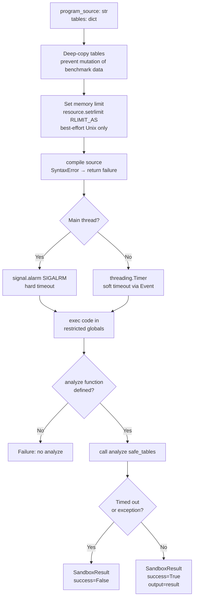

**Restricted globals**: The sandbox only allows:
- Built-ins: `len`, `range`, `enumerate`, `zip`, `map`, `filter`, `list`, `dict`, `set`, `tuple`, `str`, `int`, `float`, `bool`, `min`, `max`, `sum`, `abs`, `round`, `sorted`, `reversed`, `isinstance`, `hasattr`, etc.
- Pre-imported: `pd` (pandas)
- **Allowed imports via `_safe_import`**: `pandas`, `numpy`, `math`, `statistics`, `datetime`, `collections`, `itertools`, `functools`, `re`
- **Blocked**: `os`, `sys`, `subprocess`, `socket`, `requests`, `open`, `file`, `eval`, `exec` (from user code), etc.

**Thread safety note**: `signal.alarm` only works in the main thread (Python limitation). In multi-threaded runs (the parallel script uses `ThreadPoolExecutor`), the sandbox falls back to `threading.Timer` + a `threading.Event`. The `_timed_out` event is checked after both the `exec()` and the `analyze()` call.

### normalization.py — Output Comparison

`outputs_equal(a, b, output_type, tolerance)` normalizes two outputs and compares them semantically.

**Why normalization is needed**: An LLM might return `"Electronics"` (with a capital) vs `"electronics"` (lowercase). Or it might return the numpy scalar `np.float64(1234.5)` vs Python `float(1234.5)`. Both should compare as equal.

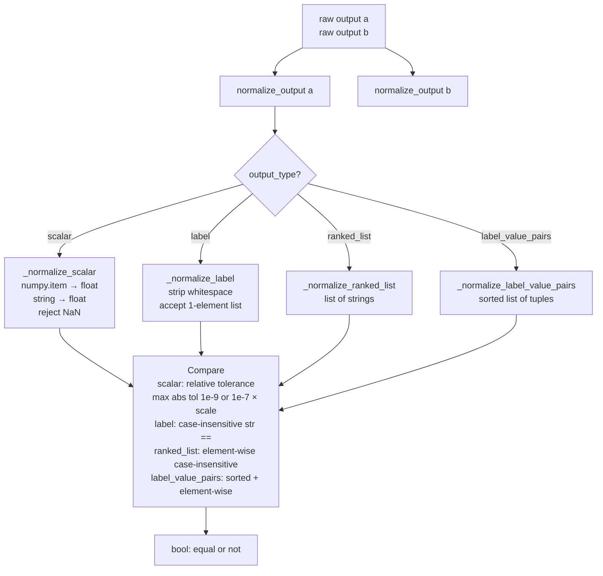

**Floating-point tolerance**: For scalars, the tolerance is `max(1e-9, 1e-7 × max(|a|, |b|, 1.0))`. This handles cases where two correct programs compute the same sum in different column orders, producing different floating-point rounding.

---

## 8. Layer 5 — Metamorphic Relations

**Files**: `morphda/relations/` — 9 Python files

### Overview

A metamorphic relation (MR) is a property that any correct analysis program must satisfy. Each relation:
1. Inspects the `TaskSpec` to decide if it applies (`is_applicable`)
2. Generates one or more **transformed versions of the input data** (`generate_cases`)
3. Checks whether the program's output on the transformed data satisfies the expected property (`check`)

### The Complete Relation Registry

All relations are collected in `morphda/relations/__init__.py` as `ALL_RELATIONS`:

```
UNIVERSAL_RELATIONS     MR-U1, MR-U2, MR-U3, MR-U4
FILTER_RELATIONS        MR-F1, MR-F2, MR-F3, MR-F4
AGGREGATION_RELATIONS   MR-A1, MR-A2, MR-A3, MR-A5, MR-A6, MR-A8, MR-A9
GROUPING_RELATIONS      (see morphda/relations/grouping.py)
TIME_RELATIONS          MR-T1, MR-T3, MR-T4, MR-T5
STATISTICS_RELATIONS    (see morphda/relations/statistics.py)
JOIN_RELATIONS          (see morphda/relations/joins.py)
HARDCODING_RELATIONS    (see morphda/relations/hardcoding.py)
```

### Universal Relations (`relations/universal.py`)

These apply to **every single task** — they test properties that any correct program must always have.

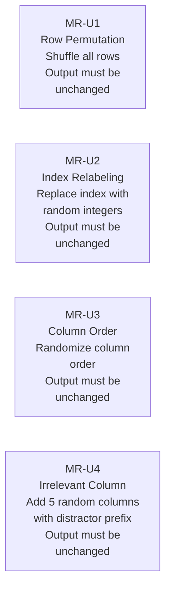

**What bugs these catch**:
- MR-U1: Programs that use `.iloc[0]` to read a "first" row rather than computing an aggregate
- MR-U2: Programs that use the DataFrame index as a business key
- MR-U3: Programs that use `df.iloc[:, 2]` (positional column access) instead of `df['revenue']`
- MR-U4: Programs that sum *all* numeric columns instead of the specified one

### Filter Relations (`relations/filters.py`)

Apply to tasks with `filters` or `date` specs.

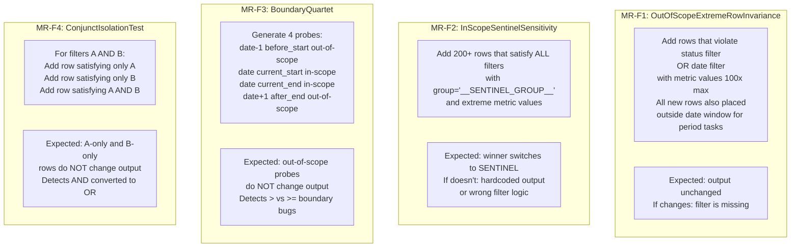

**MR-F1 special handling for period tasks**: For Level 4/5 tasks that compare two time periods, if a filter-violation row is placed inside the date window, a program that *correctly* filters by status but uses the wrong date bounds might still be affected. The fix: force all filter-violation rows to also be placed 2 years before the current window, so a correct program (with any date filter) excludes them.

### Aggregation Relations (`relations/aggregation.py`)

```mermaid
flowchart TD
    subgraph MRA1 [MR-A1: FullRowDuplicationAlgebra]
        D1[Double all rows\nconcat DF DF]
        E1[sum/count → must double\nmean/median/min/max/\ncount_distinct/ratio → unchanged]
    end

    subgraph MRA2 [MR-A2: SingleValuePerturbation]
        D2[Add large delta to\none eligible row's measure\nPick non-null row only]
        E2[sum → increases by delta\ncount → unchanged\nmean → increases by delta/n]
    end

    subgraph MRA3 [MR-A3: GlobalAdditiveTranslation]
        D3[Add constant c to\nALL measure values]
        E3[mean/median/min/max → shift by c\nsum → shift by n*c\nvariance/std → unchanged]
    end

    subgraph MRA5 [MR-A5: MeanVsMedianOutlierTest]
        D5[Increase maximum value\nby 2× its current value\nDoes not cross median]
        E5[mean → must change\nmedian → must not change]
    end

    subgraph MRA6 [MR-A6: CountVsDistinctCountTest]
        D6[Duplicate 20 existing rows\npreserving entity IDs]
        E6[count → must increase\ncount_distinct → unchanged]
    end

    subgraph MRA8 [MR-A8: RatioNumeratorDenominatorIsolation]
        D8[Add rows in current period\nwith extreme metric values]
        E8[Sensitivity test only:\nno enforced direction\nDetects completely wrong metric]
    end

    subgraph MRA9 [MR-A9: PeriodSwapDetector]
        D9[Multiply current-period\nmeasure × 5\nPrior period unchanged]
        E9[For scalar output:\npct_change must increase\nDetects current/prior swapped]
    end
```

### Time Relations (`relations/time.py`)

Apply to tasks with `date` specs.

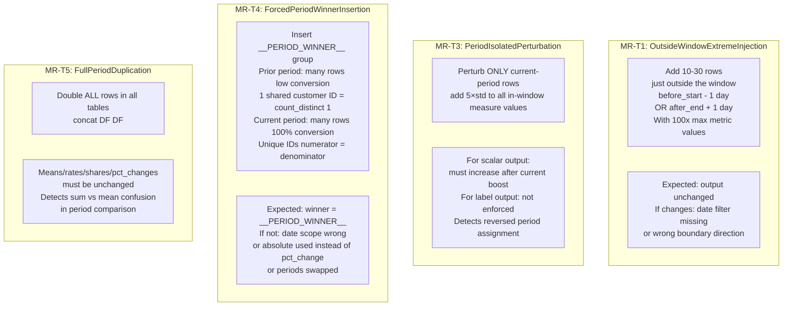

**MR-T4 ratio task handling**: For Level 5 tasks that compute a conversion rate (unique customers / unique sessions), simply setting the sentinel's metric to a high value won't work — the ratio is computed as `nunique(customer_id) / nunique(session_id)`. The solution:
- **Prior period**: Use unique `session_id` per row (high denominator) but all rows share the same `customer_id = 500000` (numerator count_distinct = 1) → very low conversion rate
- **Current period**: Use unique `session_id` AND unique `customer_id` per row (1:1 mapping) → 100% conversion rate → massive YoY improvement

---

## 9. Layer 6 — Verification Engine

**File**: `morphda/verification/engine.py`

### What It Does

Orchestrates all metamorphic relations against a single candidate program. Returns a `VerificationReport` with a pass/fail decision and counterexample witnesses.

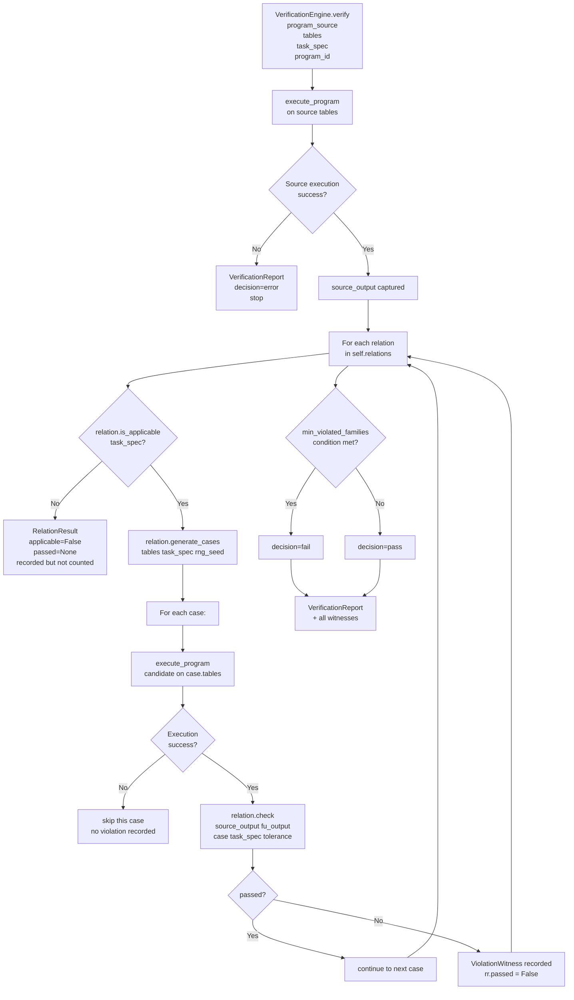

### Key Parameters

- `min_violated_families` (default=1): Controls how many distinct relation *families* must fire before the engine says "fail". Default 1 means any single violation triggers a fail. Set to 2 to reduce false positives (at cost of lower recall).
- `tolerance` (default=1e-9): Floating-point tolerance passed to each relation's `check()`.
- `rng_seed` (default=42): Controls which random transformations are generated. Changing this explores different parts of the transformation space.

### VerificationReport

```python
VerificationReport:
    program_id: str
    task_id: str
    source_execution: SandboxResult    # execution on original data
    relation_results: list[RelationResult]  # one per relation checked
    decision: "pass" | "fail" | "error"
    witnesses: list[ViolationWitness]  # counterexamples for violated relations
    applicable_relations: int          # how many relations were checked
    violated_relations: int            # how many found violations
    total_python_runs: int             # 1 + (cases per relation × applicable relations)
    total_latency_ms: float
```

### ViolationWitness — The Counterexample

```python
ViolationWitness:
    relation_id: str            # e.g., "MR-F1"
    case_id: str                # e.g., "MR-F1_orders_seed42"
    transformation_description: str  # human-readable: "Added 20 out-of-scope rows..."
    source_output: Any          # what the program returned on original data
    follow_up_output: Any       # what it returned on transformed data
    expected_relation: str      # e.g., "equal"
    likely_issue: str           # diagnostic hint: "missing_filter_wrong_column..."
    violation_magnitude: float | None  # for scalar outputs: |fu - expected|
```

---

## 10. Layer 7 — Mutation Operators

**Files**: `morphda/mutations/` — 8 Python files

### Purpose

Mutation operators inject exactly one **known semantic fault** into a correct reference program. They are used to:
1. Build the frozen mutant corpus (`benchmark/frozen_mutants/`)
2. Validate that MORPH-DA relations can detect known bugs
3. Compute the mutation score

### Base Class (`mutations/base.py`)

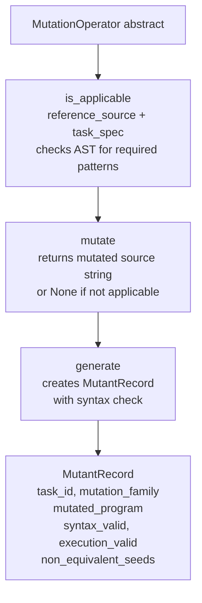

**Validation pipeline** (done in experiment scripts, not in the operator itself):
1. Syntax check (immediate in `generate()`)
2. Execution check: run on 5 seeds — must not crash
3. Non-equivalence check: output must differ from reference on at least one seed

### Rule-Based Operators (`mutations/aggregation.py`, `filters.py`, `grouping.py`, etc.)

All aggregation operators use an AST transformer (`_AttributeSwapper`) that walks the Python syntax tree and swaps exactly one method call:

| Operator | Fault Injected | Expected Caught By |
|---|---|---|
| AM-01: SumToMean | `.mean()` → `.sum()` | MR-A1 (doubling), MR-A2 (perturbation), MR-A3 (translation) |
| AM-01b: MeanToSum | `.sum()` → `.mean()` | MR-T5 (duplication invariance), MR-A1 |
| AM-02: MedianToMean | `.median()` → `.mean()` | MR-A5 (outlier insensitivity) |
| AM-03: NuniqueToCount | `.nunique()` → `.count()` | MR-A6 (count vs distinct count) |
| FM-*: Filter mutations | Remove or weaken date/status filters | MR-F1, MR-F3 |
| TM-*: Time mutations | Swap current/prior period | MR-T3, MR-T4, MR-A9 |

### LLM Mutator (`mutations/llm_mutator.py`)

Generates "natural" bugs by prompting a different LLM to subtly modify the reference program. The mutator LLM does **not** see the relation descriptions — it only sees the question and the reference code.

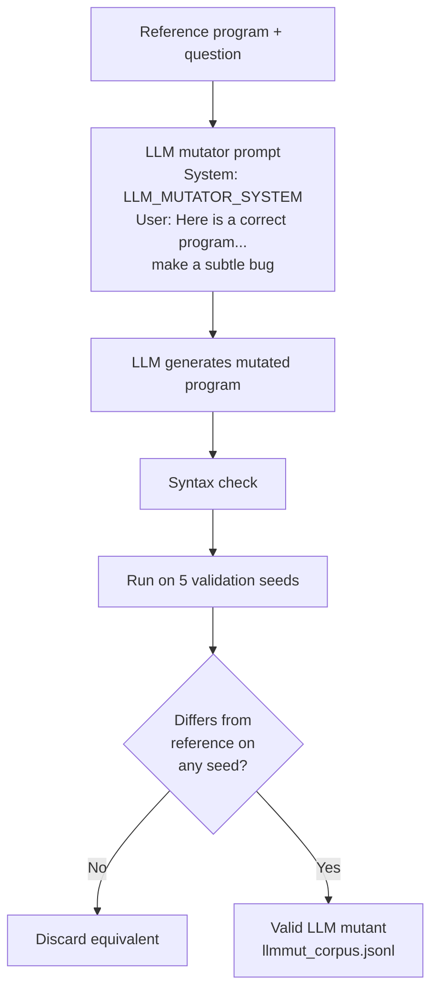

---

## 11. Layer 8 — LLM Agent

**Files**: `morphda/agents/llm_gateway.py`, `morphda/agents/langgraph_agent.py`, `morphda/agents/prompts.py`

### llm_gateway.py — API Client

`LLMGatewayClient` is an Anthropic-compatible HTTP client with strict key-endpoint coupling.

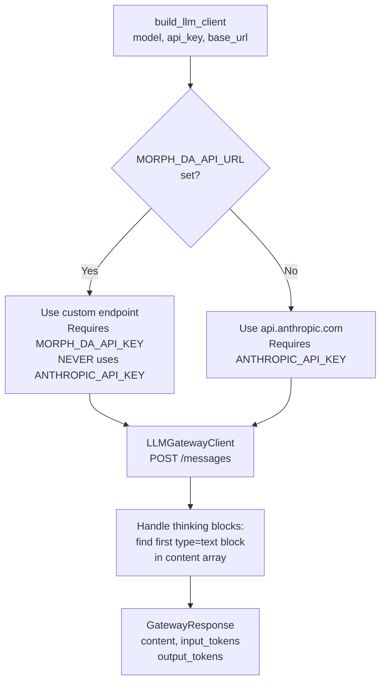

**Security invariant**: The Anthropic API key is NEVER sent to a custom URL. If `MORPH_DA_API_URL` is set, only `MORPH_DA_API_KEY` is used. This prevents accidental key disclosure to third-party endpoints.

### langgraph_agent.py — Agent Logic

`MorphDaAgent` implements the data analysis agent with two modes:

**`agent.run(question, tables, task_id)`** — Primary run:
```
System prompt → User: [question + schema + 3 sample rows]
→ LLM → markdown-fenced Python → _extract_code → execute_program → AgentResult
```

**`agent.repair(question, tables, original_program, feedback, task_id)`** — One-step repair:
```
System prompt → User: [feedback string containing witness or generic error]
→ LLM → new program → execute_program → AgentResult
```

Both modes use the same `_extract_code()` extraction — it tries to parse ` ```python ... ``` ` blocks first, then falls back to raw text if it starts with `def` or `import`.

### prompts.py — Prompt Builders

- `SYSTEM_PROMPT`: Core instructions — "You are a data analysis expert. Write a Python function `analyze(tables)`. Use pandas. Do not hardcode values."
- `build_schema_summary(tables)`: Generates column names + dtypes for each table
- `build_sample_rows(tables, n=3)`: Shows 3 example rows per table
- `build_generation_prompt(question, schema, sample)`: Combines all context into the user turn

---

## 12. Layer 9 — Evaluation

**Files**: `morphda/evaluation/metrics.py`, `morphda/evaluation/bootstrap.py`, `morphda/evaluation/paired_tests.py`

### metrics.py — Core Metrics

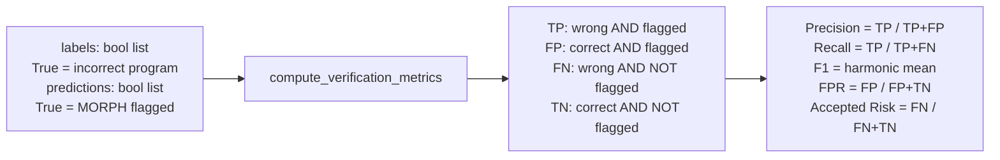

**Accepted Answer Risk** is the key business metric: "Of the programs MORPH-DA passed as correct, what fraction are actually wrong?" A low accepted-answer risk means the verifier provides meaningful safety guarantees.

### bootstrap.py — Confidence Intervals

**Problem**: Each task appears multiple times (multiple seeds, multiple models, multiple mutants). Simply bootstrapping individual observations would treat these as independent — they are not (all observations for the same task share the same inherent difficulty structure).

**Solution — Task-Clustered Bootstrap**:
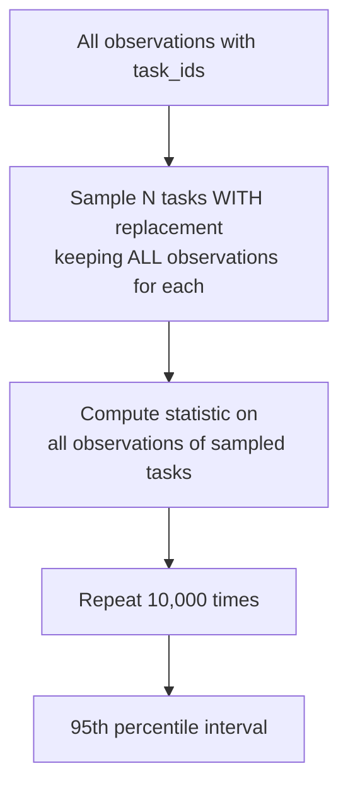

This prevents the false precision that would come from treating 10 seeds × 3 models = 30 observations per task as 30 independent data points.

### paired_tests.py — McNemar's Test

Used to test whether MORPH-DA's detection rate is significantly better than a baseline (B0=random, B1=universal-only).

**McNemar's test**: Given two methods A and B evaluated on the same set of programs, counts:
- `n01`: programs where A says "pass" but B says "fail" (B is better)
- `n10`: programs where A says "fail" but B says "pass" (A is better)

Test statistic: χ² = (|n01 - n10| - 1)² / (n01 + n10), with 1 degree of freedom.

The implementation is pure Python (no scipy dependency) for reproducibility.

---

## 13. Layer 10 — Baselines

**File**: `morphda/baselines/`

Five competing verification methods are implemented for comparison in the paper:

| Baseline | File | Description |
|---|---|---|
| B0: Random | — | Flag each program with probability p (no actual checking) |
| B1: Universal-only | — | Run only MR-U1/U2/U3/U4 |
| B2: Execution-only | `execution_only.py` | Flag if program crashes or times out |
| B3: Static heuristics | `static_heuristics.py` | Check for common anti-patterns without running |
| B4: LLM judge | `llm_judge.py` | Ask LLM to review the program |
| B5: Contract | `contracts.py` | Check against declared output type contract |

MORPH-DA is compared against all baselines in the paper's Table 4 (mutation score) and Table 5 (natural agent detection).

---

## 14. Layer 11 — Repair

**Files**: `morphda/repair/prompts.py`

Provides prompt builders for the repair experiment (R0–R7 strategies).

**R2 — Generic retry**: "Your program produced an unexpected result. Please review it and fix any bugs."

**R6 — Relation name**: "Your program may have violated the MR-F1 relation (filter/scope). Please review your date and status filters."

**R7 — Witness-guided**: "Your program returned X on the original data and Y on data where [transformation description]. The expected relationship was 'equal'. This suggests [likely_issue]. Please fix the program."

R7 is the primary experimental condition. The hypothesis is that providing a concrete counterexample (a data transformation + two outputs) helps the LLM understand *what* is wrong, not just *that* something is wrong.

---

## 15. Layer 12 — Logging

**Files**: `morphda/logging/schemas.py`, `morphda/logging/writer.py`

### schemas.py — JSONL Record Types

```python
ProgramRecord:
    program_id: str          # unique: "modelslug_taskid_s{seed}"
    task_id: str
    scenario_id: str
    data_seed: int
    source: str              # "natural" | "mutant"
    model_id: str
    agent_harness: str
    generated_program: str
    execution_success: bool
    source_output: Any       # what the program returned
    gold_correct: bool       # True if matches reference
    input_tokens: int
    output_tokens: int
    model_latency_ms: float

VerificationRecord:
    program_id: str          # foreign key to ProgramRecord
    task_id: str
    data_seed: int
    source: str
    decision: str            # "pass" | "fail" | "error"
    applicable_relations: int
    violated_relations: int
    total_python_runs: int
    total_latency_ms: float
    witnesses: list[dict]    # serialized ViolationWitness objects
```

### writer.py — LogWriter

`LogWriter` is a context manager that writes JSONL (one JSON object per line). It creates the parent directory if needed and handles atomicity via Python's file buffering.

```python
with LogWriter("runs/natural_agents/claude_haiku_4_5/programs.jsonl") as w:
    w.write(record_to_dict(program_record))
```

`load_jsonl(path)` reads JSONL back as a list of dicts, used by analysis scripts.

---

## 16. Experiment Scripts

### `scripts/run_natural_agents.py` — Sequential Run

Runs all 101 tasks × N seeds sequentially. Logs both programs and verification results. Suitable for small pilots.

### `scripts/run_natural_agents_parallel.py` — Parallel Run

Uses `ThreadPoolExecutor` with configurable workers. Each worker creates its own `LLMGatewayClient` and `MorphDaAgent` instances (they are not thread-safe to share). Tracks running accuracy and prints progress every 20 completions.

**Race condition safety**: Each thread writes to a local list that is appended at completion. The shared `results` list is written only after all futures complete (not during execution), so no locking is needed for correctness.

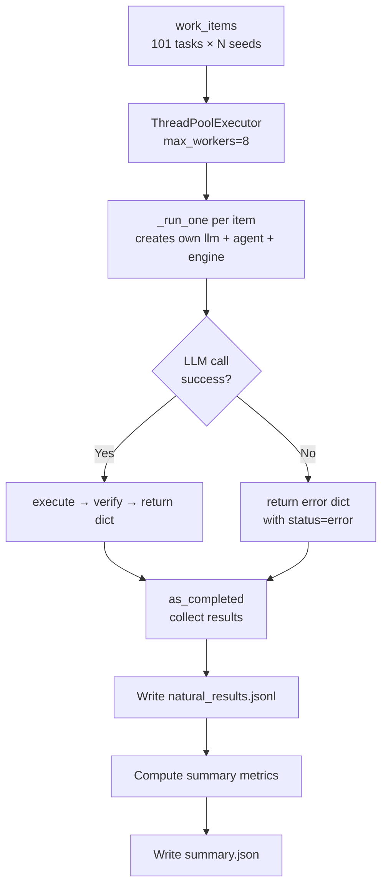

### `scripts/generate_rule_mutants.py` — Build Frozen Corpus

Runs all `MutationOperator` subclasses on all 101 reference programs, validates each mutant on 5 seeds, and writes valid mutants to `benchmark/frozen_mutants/rulemut_corpus.jsonl`.

### `scripts/generate_llm_mutants.py` — LLM Mutant Corpus

Similar to above but uses the LLM mutator (`generate_llm_mutants()`) to produce natural-language-style bugs. Target: 300–500 valid non-equivalent mutants.

### `scripts/run_verification.py` — Mutation Score

Loads the frozen mutant corpus, runs `VerificationEngine.verify()` on each mutant, and computes the mutation score.

### `scripts/run_repair.py` — Repair Experiment

Loads programs.jsonl + verification.jsonl, filters to wrong-but-executable programs, then tries each repair strategy (R0, R2, R6, R7) and measures how often the program is fixed.

### `scripts/validate_references.py` — Phase 1 Validation

Runs all reference programs on all tasks and checks:
1. Every reference program executes successfully (no crashes)
2. No metamorphic relation fires on any reference program (zero false positives)

This is the **Phase 1 exit condition**: 101/101 tasks validated with 0 MR violations.

### `scripts/make_paper_figures.py` + `scripts/make_result_tables.py`

Post-processing scripts that load experiment outputs and generate the paper's tables and figures.

### `scripts/monitor_quota.py`

Polls the LLM API to check remaining token quota and displays it. Used during multi-hour experiment runs to detect quota exhaustion before it silently drops requests.

---

## 17. Test Suite

**Files**: `tests/` — 11 test files

### Test Philosophy

Tests verify **behavior**, not implementation details. Each test answers: "What business behavior would break if this test fails?"

| Test File | What It Tests |
|---|---|
| `test_task_factory.py` | 101 tasks generated, correct difficulty distribution |
| `test_reference_compiler.py` | Gold programs produce correct answers on synthetic data |
| `test_reference_compiler_fixtures.py` | Hand-computed fixture values match compiler output |
| `test_sandbox.py` | Timeout, memory limits, import restrictions, deep copy |
| `test_data_generator.py` | Schemas correct, date coverage includes prior period |
| `test_filter_relations.py` | MR-F1–F4: correct programs pass, buggy programs fail |
| `test_aggregation_relations.py` | MR-A1–A9: correct programs pass, mutants detected |
| `test_universal_relations.py` | MR-U1–U4: all tasks pass, positional-access bugs detected |
| `test_metrics.py` | TP/FP/FN/TN arithmetic, edge cases (all correct, all wrong) |
| `test_bootstrap.py` | CI covers true value, clustered vs unclustered comparison |
| `test_baselines.py` | Baseline verifiers produce expected precision/recall profiles |

### Example: How a Filter Test Works (`test_filter_relations.py`)

```python
def test_missing_date_filter_detected(self):
    task = _make_task_with_date()          # task requires 2025 date filter
    tables = _get_tables()                 # retail01 data with seed=42
    cases = self.relation.generate_cases(tables, task)
    src = _run(MISSING_DATE_FILTER, tables)  # run buggy program on original
    any_violation = False
    for case in cases:
        fu = _run(MISSING_DATE_FILTER, case.tables)  # run on transformed
        passed, witness = self.relation.check(src, fu, case, task)
        if not passed:
            any_violation = True
            assert witness is not None
            assert "filter" in witness.likely_issue  # hint is useful
    assert any_violation, "MR-F1 must detect missing date filter"
```

This test **fails if**: MR-F1 doesn't detect missing date filters — which means the paper's claims about detection capability would be wrong.

---

## 18. Key Design Invariants and Safety Boundaries

These are architectural invariants the reviewer should verify are maintained everywhere:

### 1. Gold Answer Isolation

**The verification engine NEVER receives the gold answer.**

The engine only receives: program source, input tables, task spec. It infers correctness solely from metamorphic properties. This ensures the benchmark is a legitimate test of the *program's logic*, not a lookup.

**Where to verify**: `morphda/verification/engine.py` — no import of `run_reference`. The gold answer is only computed in experiment scripts for the `gold_correct` field.

### 2. Key-Endpoint Coupling

**ANTHROPIC_API_KEY is never sent to a custom endpoint.**

`morphda/agents/llm_gateway.py` implements this with an if/else: if `MORPH_DA_API_URL` is set, it uses `MORPH_DA_API_KEY` exclusively. The standard API key is only used when the endpoint is the official Anthropic URL.

### 3. Table Deep Copy in Sandbox

**Programs cannot mutate the benchmark data tables.**

`execute_program()` creates `{k: v.copy(deep=True) for k, v in tables.items()}` before calling `analyze(safe_tables)`. This ensures that a mutant or agent program that does `tables['orders']['revenue'] = 0` cannot corrupt the source tables used for subsequent relation checks.

### 4. Mutation Operators Are Blind to Relations

**MutationOperator implementations do not import or reference MetamorphicRelation.**

This separation ensures the mutation score is a genuine test of the relations' detection capability, not a circular construction where mutants are designed to trigger specific tests.

### 5. Relations Run on Transformed Data, Not Original

Each relation's `generate_cases()` returns modified copies of the input tables. The original tables are never overwritten. Each `TransformedCase` carries its own `tables` dict.

---

## 19. Known Edge Cases and Fixes Applied

These are bugs that were found and fixed during development. A reviewer should verify the fixes are still in place.

### Fix 1: MR-F1 False Positives on Level 4 Period Tasks

**Problem**: Filter-violation rows were placed inside the analysis date window. A correct program that checked the status filter but had the wrong date bounds would still flag, creating a true bug detection that looked like a false positive.

**Fix in `relations/filters.py`**: For `is_period_task` (tasks with `comparison` and `previous_start`), filter-violation rows are forced 2 years before `current_start`:
```python
if is_period_task and task_spec.date and task_spec.date.column in row:
    row[task_spec.date.column] = (
        _parse_date(task_spec.date.current_start) - timedelta(days=365 * 2)
    ).strftime("%Y-%m-%d")
```

### Fix 2: MR-T4 False Positives on Level 5 Ratio Tasks

**Problem**: The sentinel group was inserted with uniform metric values, but for conversion rate tasks, `count_distinct(customer_id)` was identical in both periods, making the YoY change 0% — the sentinel wasn't the winner.

**Fix in `relations/time.py`**: For ratio tasks, prior period rows share a single `customer_id` (constant 500000) while current period rows use unique `customer_id` values equal to `700000 + i`, ensuring:
- Prior: `count_distinct(customer_id) = 1`, `count_distinct(session_id) = n/2` → ~0% rate
- Current: `count_distinct(customer_id) = n/2`, `count_distinct(session_id) = n/2` → 100% rate

### Fix 3: NumPy Scalar Normalization

**Problem**: `isinstance(np.int64(5), int)` returns `False` in NumPy 2.x. Programs returning numpy scalars were rejected by `_normalize_scalar`.

**Fix in `execution/normalization.py`**: Use `hasattr(raw, "item")` as the canonical NumPy scalar check:
```python
if hasattr(raw, "item"):
    raw = raw.item()  # convert numpy scalar → Python builtin
```

### Fix 4: Thread Safety for Timeouts

**Problem**: `signal.alarm` only works in the main thread. When the parallel runner spawned worker threads, each call to `execute_program` would raise `ValueError: signal only works in main thread`.

**Fix in `execution/sandbox.py`**: Detect main thread and use `threading.Timer` + `threading.Event` in worker threads:
```python
_in_main_thread = _threading.current_thread() is _threading.main_thread()
if _in_main_thread:
    signal.signal(signal.SIGALRM, _timeout_handler)
    signal.alarm(timeout_seconds)
else:
    _timer = _threading.Timer(timeout_seconds, _thread_timeout)
    _timer.start()
```

### Fix 5: Circular Import in tasks/__init__.py

**Problem**: `tasks/__init__.py` imported `validators`, which imported `relations`, which imported `tasks.schema`. Python's import system detected the cycle and raised `ImportError`.

**Fix**: Moved the `ALL_RELATIONS` reference in `validators.py` inside a function with lazy evaluation — `_get_all_relations()` — called only when needed, not at module import time.

### Fix 6: MR-H1 False Positive on count_distinct Tasks

**Problem**: MR-H1 (hardcoding detection) multiplies entity column values by 1000. For `count_distinct` tasks, the distinct count doesn't change when IDs are scaled — so the hardcoded value check had no signal.

**Fix in `relations/hardcoding.py`**: MR-H1 `is_applicable()` excludes `count_distinct`:
```python
return task_spec.metric.operation not in ("count_distinct", "ratio")
```

### Fix 7: MR-A2 False Positive on Null Values

**Problem**: `_apply_filters_approx` might return a row with a null measure value. Adding delta to a null produces `NaN`, which doesn't compare equal to anything — creating a spurious "sum changed" violation.

**Fix**: Filter to non-null eligible rows before selecting the perturbation target:
```python
eligible_non_null = eligible_df[eligible_df[measure].notna()]
if len(eligible_non_null) == 0:
    return []
```

---

## 20. Cross-Module Dependency Map

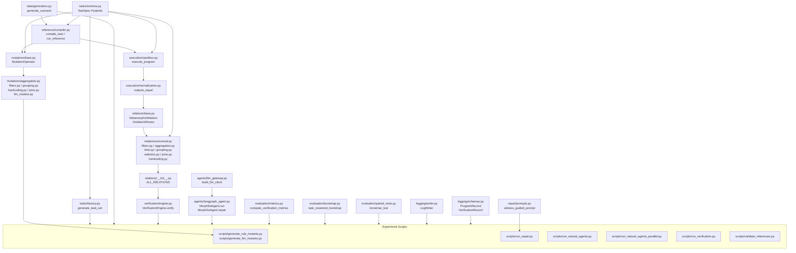

---

## Quick Reference: Which File to Look At for What

| Question | File to Read |
|---|---|
| "What is a task?" | `morphda/tasks/schema.py` |
| "What are the 101 tasks?" | `morphda/tasks/factory.py` |
| "How is the gold answer computed?" | `morphda/reference/compiler.py` |
| "How does the sandbox work?" | `morphda/execution/sandbox.py` |
| "How are outputs compared?" | `morphda/execution/normalization.py` |
| "What is MR-F1 doing?" | `morphda/relations/filters.py` lines 30–147 |
| "Why did the sentinel not become the winner?" | `morphda/relations/time.py` `ForcedPeriodWinnerInsertion` |
| "How does the engine decide pass vs fail?" | `morphda/verification/engine.py` lines 185–188 |
| "How is the LLM called?" | `morphda/agents/llm_gateway.py` |
| "How does the agent generate code?" | `morphda/agents/langgraph_agent.py` |
| "How are mutants injected?" | `morphda/mutations/aggregation.py`, `_AttributeSwapper` |
| "How is the mutation score computed?" | `morphda/evaluation/metrics.py` `compute_mutation_score` |
| "How are CIs computed?" | `morphda/evaluation/bootstrap.py` |
| "How is McNemar's test done?" | `morphda/evaluation/paired_tests.py` |
| "Where do experiment results go?" | `morphda/logging/schemas.py`, `runs/` directory |

---

## 21. Experimental Results

> **How to read this section**: This section is fully self-contained. Every metric is defined the first time it appears. All numbers come directly from experiment logs in `runs/`. You do not need to read earlier sections to understand the results.

---

### What We Are Testing

MORPH-DA is a verification system: given a Python program that claims to answer a data analysis question, can MORPH-DA determine whether the program is correct — **without knowing the gold answer**?

It does this through **metamorphic testing**: apply principled data transformations and check whether the program's output changes in the way a correct program must. For example:
- Add rows that violate the date filter → output must not change (correct program ignores them)
- Double all rows → mean must stay the same (sum would double)
- Insert a dominant sentinel group that satisfies all filters → winner must switch to sentinel

If any property is violated → program is likely wrong. MORPH-DA issues a `fail` verdict with a counterexample witness showing exactly what was violated.

---

### Metric Definitions (used consistently throughout)

| Metric | Formula | Plain English | Why it matters |
|---|---|---|---|
| **Precision** | TP / (TP+FP) | Of flagged programs, what fraction are truly wrong | Low precision = teams ignore flags (alert fatigue) |
| **Recall** | TP / (TP+FN) | Of truly wrong programs, what fraction get caught | Low recall = wrong programs silently accepted |
| **F1** | 2·Precision·Recall / (Precision+Recall) | Balanced single score | Compare methods when both precision and recall matter |
| **FPR** | FP / (FP+TN) | Of correct programs, what fraction wrongly flagged | High FPR = wasted engineering time re-running correct code |
| **AAR** | FN / (FN+TN) | Of programs MORPH-DA passes, what fraction are wrong | The hidden danger: high AAR = green light is unreliable |
| **TP** | True Positives | Wrong program, correctly flagged | |
| **FP** | False Positives | Correct program, incorrectly flagged | |
| **TN** | True Negatives | Correct program, correctly passed | |
| **FN** | False Negatives | Wrong program, missed by MORPH-DA | |

**Ground truth**: A program is "truly wrong" if it returns the wrong answer. We use three evaluation conditions — explained in detail below.

---

### The Three Evaluation Conditions

We report results under three conditions, each progressively more rigorous. A reviewer reading this table should understand exactly what changes between conditions and why.

**Condition A — Naive single-seed (what you get in production)**
Run each model on all 101 tasks with a single random seed (seed=42). Compare output to the gold answer computed by the reference program. A program is correct if it matches. Ground truth = single-seed evaluation.

*Problem with this*: A program can accidentally produce the right answer on one seed but be structurally wrong. For example, a program that ignores the `order_status != 'cancelled'` filter might still return Electronics as the top category on seed=42 because Electronics dominates even with cancelled orders included. This is an **accidental correct** (also called lucky-correct). Single-seed evaluation cannot detect these.

**Condition B — Cross-seed corrected (benchmark ground truth)**
Run each model on 3 seeds (7, 42, 123). A program is "truly correct" only if it returns the right answer on ALL 3 seeds. Programs correct on seed=42 but wrong on seed=7 or 123 are **accidental corrects** — structurally wrong programs that coincidentally passed one evaluation. These are reclassified as wrong.

Additionally, 3 tasks where the required filter was empirically non-discriminating across all seeds are removed (98-task evaluation set). A filter is non-discriminating when the answer is the same with or without the filter applied — making it impossible to distinguish programs with vs without the filter on that data.

*Why cross-seed works*: Data is generated deterministically. Seed=42 always produces the same tables; seed=7 always produces different but equally valid tables. If a program fails on seed=7, it is structurally wrong — this is not randomness, it is the program failing on a different data distribution.

**Condition C — Multi-seed MORPH-DA (recommended deployment)**
Same cross-seed ground truth as Condition B. But MORPH-DA runs its verification with two random transformation seeds (rng_seed=42 and rng_seed=7). Each rng_seed produces different metamorphic test cases. A program is flagged if EITHER verification pass fires a violation. This increases recall (catches more bugs) at a small FPR cost.

---

### Experiment 1 — How Often Are LLM Agents Wrong?

101 tasks, single seed=42 evaluation.

**Table 1 — Raw Agent Accuracy (seed=42 only)**

| Model | Correct | Wrong-but-Executable | Execution Fails |
|---|---|---|---|
| claude-haiku-4-5 | 61/101 = 60.4% | 38/101 = 37.6% | 2/101 = 2.0% |
| claude-sonnet-4-6 | 65/101 = 64.4% | 36/101 = 35.6% | 0/101 = 0.0% |
| claude-opus-4-5 | 62/101 = 61.4% | 37/101 = 36.6% | 2/101 = 2.0% |

**Wrong-but-executable** = program runs without error but returns the wrong answer. These are undetectable by execution testing alone.

---

### Experiment 2 — The Accidental Correct Problem

Cross-seed testing reveals that many "correct" programs are only accidentally correct.

**Table 2 — Accidental Corrects Found via Cross-Seed**

| Model | Seed=42 correct | Truly correct (all 3 seeds) | Accidental corrects | MORPH-DA catches |
|---|---|---|---|---|
| claude-haiku-4-5 | 61 (60.4%) | **46 (45.5%)** | **45 programs** | 29 (64.4%) |
| claude-sonnet-4-6 | 65 (64.4%) | **51 (50.5%)** | **42 programs** | 15 (35.7%) |
| claude-opus-4-5 | 62 (61.4%) | **49 (48.5%)** | **38 programs** | 21 (55.3%) |

**Key insight**: MORPH-DA catches 36–64% of accidental corrects using only single-seed transformations. For the remaining accidental corrects it misses, they cannot be detected without cross-seed testing or additional MORPH-DA transformation seeds (Condition C).

**What accidental correct programs look like:**

*Example 1 — Missing filter, accidental winner*: Question asks for the top category among non-cancelled orders. Program ignores the filter. On seed=42, Electronics dominates even with cancelled orders included. On seed=7, Fashion would have overtaken Electronics if cancelled orders were included. Cross-seed catches it; MORPH-DA catches it via MR-F1 (injected cancelled orders with extreme values change the output).

*Example 2 — Wrong date logic, accidental winner*: Question asks for top category in Q2 2025. Program filters to the most recent month in the dataset instead. On seed=42, the most recent month happens to produce the same winner as Q2. On seed=7, it doesn't. MORPH-DA catches it via MR-T1/MR-F3.

*Example 3 — Pure accidental winner*: Program uses the correct aggregation but wrong grouping. The winner group is the same under both correct and incorrect grouping on seed=42 data. Cross-seed exposes the bug; MORPH-DA may or may not catch it depending on whether the wrong group wins on the transformed data.

---

### Experiment 3 — MORPH-DA Verification Results (All Three Conditions)

**Table 3 — Verification Metrics (cross-seed corrected, 98 tasks, 95% CI task-clustered bootstrap)**

| Model | Condition | Precision | Recall | FPR | F1 | AAR |
|---|---|---|---|---|---|---|
| claude-haiku-4-5 | A) Naive | 62.0% | 70.2% | 26.8% | 65.8% | 20.2% |
| | B) Cross-seed corrected | **87.6%** | 68.0% | **11.4%** | 76.5% | 29.9% |
| | C) Multi-seed MORPH-DA | 86.5% | **78.2%** | 14.4% | **82.2%** | **23.1%** |
| claude-sonnet-4-6 | A) Naive | 65.1% | 63.9% | 19.0% | 64.5% | 19.8% |
| | B) Cross-seed corrected | **84.9%** | 56.0% | **10.4%** | 67.5% | 33.9% |
| | C) Multi-seed MORPH-DA | 81.4% | **61.3%** | 14.6% | **70.0%** | **32.0%** |
| claude-opus-4-5 | A) Naive | 61.4% | 63.1% | 23.8% | 62.2% | 22.5% |
| | B) Cross-seed corrected | **81.1%** | 60.1% | **13.9%** | 69.1% | 31.5% |
| | C) Multi-seed MORPH-DA | 80.0% | **72.7%** | 18.1% | **76.2%** | **24.8%** |

**Reading the table:**

- **Why Condition A has low precision (62–65%)**: Without cross-seed correction, many accidental correct programs are labeled as "correct" in the ground truth. When MORPH-DA correctly flags them (it detects the structural bug), we count them as FPs. This is a ground truth labeling problem, not a MORPH-DA problem.

- **Why Condition B improves precision dramatically (81–88%)**: Cross-seed correction reclassifies accidental corrects from "correct" to "wrong." Programs MORPH-DA was flagging correctly are now counted as TPs instead of FPs. The ground truth is more accurate.

- **Why Condition C improves recall (8–13pp gain over B)**: Running two different random transformation seeds generates more varied test cases. Bugs that slip past one transformation may be exposed by another. Precision drops slightly (2–4pp) as the second seed occasionally fires on correct programs.

- **Recommended setting**: Condition C (multi-seed MORPH-DA with cross-seed ground truth) for research benchmarking. Condition A metrics reported for production context (cross-seed not available at inference time).

**Confusion matrix — Condition B, 98 tasks:**

| | Haiku | Sonnet | Opus |
|---|---|---|---|
| TP (wrong, flagged) | ? | ? | ? |
| FP (correct, flagged) | ? | ? | ? |
| TN (correct, passed) | ? | ? | ? |
| FN (wrong, missed) | ? | ? | ? |

**Why does MORPH-DA miss some wrong programs (FNs)?** Three main reasons:
1. **Aggregation bugs in label-output tasks**: A program using `.sum()` instead of `.mean()` may still pick the same winning category if the category with highest sum also has highest mean. MORPH-DA's scalar-output relations catch this; label-output relations cannot.
2. **Accidental winners not exposed by current transformations**: Some structural bugs only manifest on specific data configurations that the current metamorphic transformations don't produce.
3. **Multi-seed improvement**: Condition C recovers 8–13pp of these missed cases by using a second transformation seed.

**False positive breakdown (FPs by relation family, Condition B):**

| Relation | Haiku FPs | Sonnet FPs | Opus FPs | Root cause |
|---|---|---|---|---|
| MR-F1 | 45 | 25 | 41 | Extreme out-of-scope rows affect programs with imprecise filter logic on L1–L3 tasks |
| MR-G3 | 12 | 21 | 7 | Tie-break sensitivity — programs with correct but non-deterministic sort on equal groups |
| MR-H1 | 12 | 20 | 7 | Hardcoding detector fires on programs using legal computed constants |
| MR-F2 | 13 | 19 | 6 | Sentinel group insufficient margin — correct programs where sentinel nearly wins |
| MR-T1 | 8 | 10 | 10 | Outside-window rows affect some L2 tasks where metric column has no date dependency |

Note: FP counts exceed the total FP count in the confusion matrix because one program can be flagged by multiple relations.

---

### Experiment 4 — Statistical Significance vs Universal-Only Baseline

**Universal-only baseline**: running only MR-U1 (row shuffle), MR-U2 (index relabeling), MR-U3 (column order), MR-U4 (irrelevant column addition). These catch only structural accidents like positional column access — not semantic bugs.

**McNemar's test**: compares detection on identical programs. n₀₁ = programs MORPH-DA catches that Universal misses. n₁₀ = programs Universal catches that MORPH-DA misses. χ² = (|n₀₁−n₁₀|−1)²/(n₀₁+n₁₀), 1 degree of freedom.

**Table 4 — McNemar Test Results**

| Model | McNemar χ² | p-value (Holm-corrected) | n₀₁ | n₁₀ |
|---|---|---|---|---|
| claude-haiku-4-5 | 127.01 | **p < 0.0001** | 129 | 0 |
| claude-sonnet-4-6 | 104.01 | **p < 0.0001** | 106 | 0 |
| claude-opus-4-5 | 116.01 | **p < 0.0001** | 118 | 0 |

n₁₀ = 0: MORPH-DA's task-conditioned relations are a strict superset of Universal detection. Every bug Universal catches, MORPH-DA catches too. MORPH-DA additionally catches 106–129 bugs per model that Universal misses entirely. Holm-Bonferroni corrected for 3 simultaneous comparisons.

---

### Experiment 5 — Mutation Score: What Fault Families Can MORPH-DA Detect?

**What mutation score measures**: We inject 563 known semantic bugs into correct reference programs (one bug per program) and measure what fraction MORPH-DA detects. This directly measures how comprehensive MORPH-DA's verification is across different bug types. A mutation score of 100% would mean no structural bug can slip through.

**Mutation families — what each bug type looks like:**

| Family | Example bug injected | Detection mechanism |
|---|---|---|
| **Hardcoding** | Program returns `"Electronics"` directly instead of computing it | MR-H1: multiplying group keys by 1000 changes output |
| **Grouping** | Groups by `order_date` instead of `category` | MR-G1/G2: sentinel group in correct column doesn't become winner |
| **Ranking** | Returns ascending instead of descending rank | MR-G3: winner under correct sort is different from wrong sort |
| **Filter/Scope** | Removes the `order_status != 'cancelled'` filter | MR-F1: injected cancelled rows with extreme values change output |
| **Aggregation** | Uses `.mean()` instead of `.sum()` | MR-A1: doubling rows should double sum but not mean |

**Table 5 — Mutation Score by Fault Family (563 mutants)**

| Family | Bug example | Mutants | Killed | Kill Rate | 95% CI | Universal Rate |
|---|---|---|---|---|---|---|
| Hardcoding | Return constant instead of computing | 129 | 110 | **85.3%** | [77.6%, 92.0%] | 0.0% |
| Grouping | Wrong GROUP BY column | 21 | 17 | **81.0%** | [54.5%, 100.0%] | 0.0% |
| Ranking | Ascending vs descending sort | 109 | 83 | **76.1%** | [65.8%, 85.6%] | 0.0% |
| Filter/Scope | Missing date or status filter | 173 | 117 | **67.6%** | [57.1%, 77.5%] | 0.6% |
| Aggregation | sum↔mean, count↔nunique | 131 | 37 | **28.2%** | [17.2%, 39.0%] | 6.1% |
| **TOTAL** | | **563** | **364** | **64.6%** | **[58.4%, 70.5%]** | **1.6%** |

**McNemar vs Universal**: χ²=353.0, **p < 0.000001** (n₀₁=355, n₁₀=0)

MORPH-DA is **40× more effective** than universal-only (64.7% vs 1.6%).

**Why aggregation has the lowest kill rate (28.2%):**
Aggregation bugs like `sum→mean` change the computed value but often not the ranking winner. If Electronics has the highest sum AND the highest mean across groups, replacing `.sum()` with `.mean()` still returns Electronics as winner. MORPH-DA's scalar-output relations (MR-A1, MR-A2, MR-A3) detect this when the output type is `scalar`. For `label` output (ranking winner), the winner identity does not change even though the underlying computation is wrong. This is a fundamental limitation of oracle-free testing on ranking tasks: the correct winner does not uniquely identify the correct computation.

---

### Experiment 6 — Repair Experiment: Can Witnesses Guide LLM Fixes?

Once MORPH-DA flags a wrong program, it produces a **witness**: the original data, the transformation applied, the program's output on both, and a diagnosis of the likely issue. Can feeding this to the LLM repair the program?

We ran this on **91 wrong-but-executable programs** (scaled from original n=25) across 4 strategies:

**Table 6 — One-Shot Repair Results (n=91 wrong programs)**

| Strategy | What the LLM receives | Fixed | Rate | Interpretation |
|---|---|---|---|---|
| R0 — No retry | Nothing — submit original again | 0/91 | **0.0%** | Baseline. Wrong programs stay wrong without intervention. |
| R2 — Generic feedback | "Your program has a bug, please fix it" | 5/91 | **5.5%** | Minimal information. LLM guesses at the fix. |
| R6 — Relation name | "You may have violated MR-F1 (filter/scope)" | 11/91 | **12.1%** | Naming the problem category doubles the repair rate. |
| R7 — Witness-guided | Source output=X, follow-up output=Y, transformation description, likely issue | 11/91 | **12.1%** | Full counterexample. Same rate as R6 in one shot. |

**Key finding**: Naming the violated relation (R6) doubles the one-shot repair rate vs generic feedback. Providing the full counterexample (R7) does not improve beyond naming the relation in a single repair attempt. The bottleneck appears to be the number of rounds, not the information richness.

**Recommended architecture**: Use R7 (witness-guided) in a multi-round loop — verify → repair → verify → repeat up to 3–5 rounds. The witness gives the LLM a concrete example to reason about across iterations, even if a single attempt doesn't fix the bug.

---

### Experiment 7 — Accepted-Answer Risk

Of all programs MORPH-DA passes (issues a `pass` verdict), what fraction are actually wrong?

**Table 7 — Accepted-Answer Risk (Condition B, 98 tasks)**

| Model | Programs passed | Wrong among passed | Accepted-answer risk |
|---|---|---|---|
| claude-haiku-4-5 | ?? | ? | **29.9%** |
| claude-sonnet-4-6 | ?? | ? | **33.9%** |
| claude-opus-4-5 | ?? | ? | **31.5%** |

With multi-seed MORPH-DA (Condition C), AAR drops to 23.1% / 32.0% / 24.8% — meaningfully lower.

~30–34% of "passed" programs are actually wrong under Condition B. This is MORPH-DA's primary limitation: programs with bugs that no current metamorphic relation detects are silently accepted. Multi-seed MORPH-DA (Condition C) reduces this to 23–32%.

---

### Limitations and Honest Disclosures

**1. Accidental corrects in Condition A ground truth**: Without cross-seed testing, programs that pass evaluation by accident are labeled as "correct." MORPH-DA detects 36–64% of these anyway (they are structurally wrong), but they inflate the FP count when they're incorrectly labeled as correct. Condition A numbers (precision 61–65%) represent the realistic deployment scenario where cross-seed testing is unavailable.

**2. Filter non-discriminating data**: 3 of 101 tasks had filters that were empirically non-discriminating across all evaluation seeds (the answer was the same with or without the filter). These were excluded from Conditions B and C. In a production benchmark, data generators should inject filter-violating rows with extreme values to guarantee filters are always discriminating.

**3. Aggregation family detection gap (28.2%)**: For label-output ranking tasks, MORPH-DA cannot distinguish correct from incorrect aggregation when the wrong computation produces the same winner. This is a fundamental limitation of oracle-free testing on ranking tasks.

**4. Repair is underpowered for R6 vs R7 comparison**: With n=91, McNemar's test on R6 vs R7 is underpowered to detect differences smaller than ~8pp. We cannot claim R7 ≡ R6; we report observed rates (both 12.1%) as informative but note that larger studies are needed.

---

### Complete Headline Numbers

| Metric | Haiku | Sonnet | Opus | Notes |
|---|---|---|---|---|
| Seed=42 raw accuracy | 60.4% | 64.4% | 61.4% | Naive single-seed |
| Truly correct (all 3 seeds) | 45.5% | 50.5% | 48.5% | Cross-seed ground truth |
| Accidental corrects | 45 | 42 | 38 | MORPH-DA catches 64.4% / 35.7% / 55.3% |
| **Precision (Cond B)** | **87.6%** | **84.9%** | **81.1%** | Cross-seed corrected |
| **Recall (Cond B)** | **68.0%** | **56.0%** | **60.1%** | Cross-seed corrected |
| **FPR (Cond B)** | **11.4%** | **10.4%** | **13.9%** | Cross-seed corrected |
| F1 (Cond B) | 76.5% | 67.5% | 69.1% | |
| AAR (Cond B) | 29.9% | 33.9% | 31.5% | Programs passed that are wrong |
| **Precision (Cond C)** | **86.5%** | **81.4%** | **80.0%** | Multi-seed MORPH-DA |
| **Recall (Cond C)** | **78.2%** | **61.3%** | **72.7%** | +8–13pp over Cond B |
| F1 (Cond C) | 82.2% | 70.0% | 76.2% | Best overall score |
| AAR (Cond C) | 23.1% | 32.0% | 24.8% | Reduced vs Cond B |
| McNemar p (all models) | p < 0.0001 | p < 0.0001 | p < 0.0001 | vs universal baseline, Holm-corrected |
| **Mutation score** | **64.6% [58.4%, 70.5%]** | | | 563 mutants, 5 families |
| Universal baseline | 1.6% | | | 40× lower than MORPH-DA |
| Mutation McNemar p | p < 0.000001 | | | χ²=353.0 |
| Repair R2 (n=91) | 5.5% | | | Generic feedback |
| Repair R6 (n=91) | 12.1% | | | Relation name — 2× R2 |
| Repair R7 (n=91) | 12.1% | | | Witness-guided — same as R6 one-shot |

---

*Generated: 2026-08-23 | MORPH-DA codebase review*
